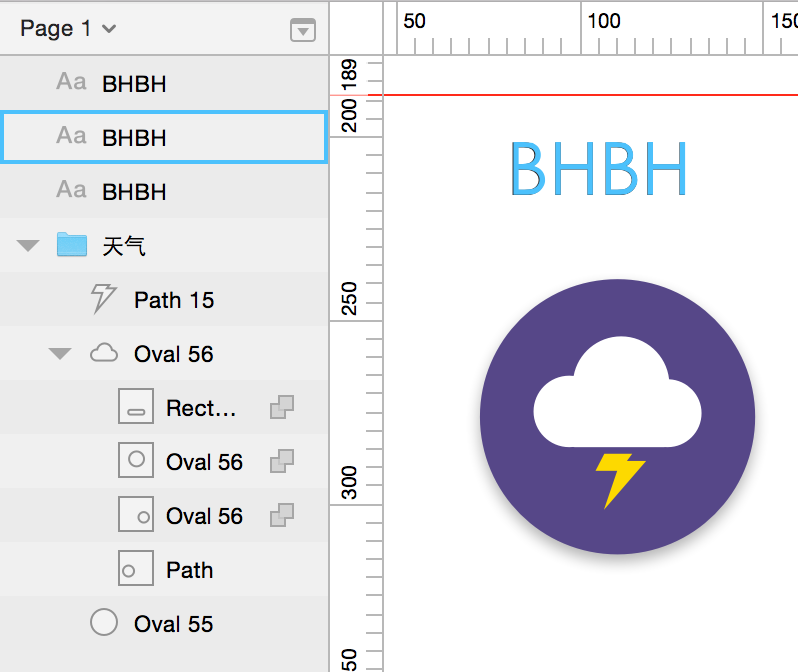
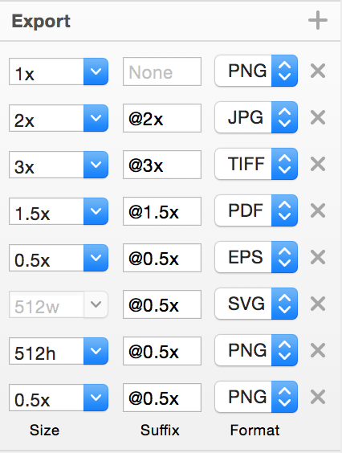
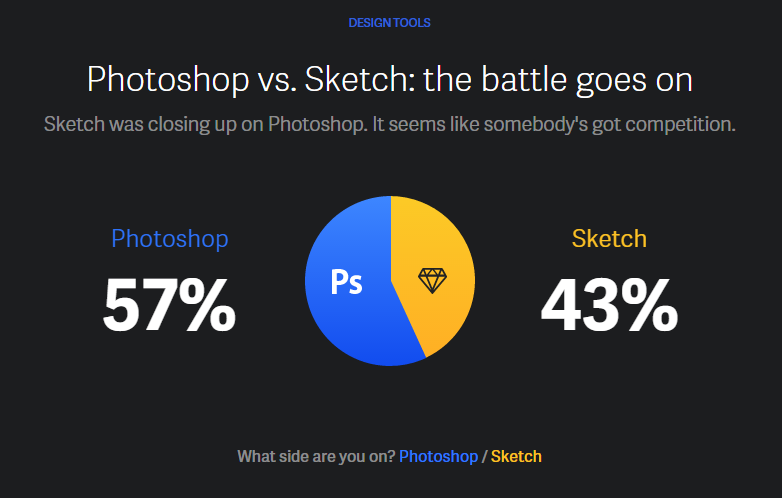
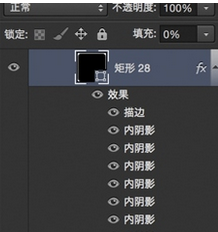

Sketch作为一个为UI设计而生的工具，全矢量、轻量级、像素级精准，非常适合做移动端应用类的界面设计和简单的扁平图标设计。

他轻巧 优雅 高效，三点相辅相成 。出道至今已经强力地占据了一片设计师市场，经常被拿来跟PS对比。

下文是我通过一段时间的使用，对比PS，梳理了Sketch对我们而言的优点和痛点，探讨了下Sketch对提升工作效率是否有帮助，文末还附带了一些延伸阅读。


#PART1 Sketch的8大优势
###1.小清新颜值高
简洁高效 抗干扰

界面简洁美好，功能清晰。无悬浮面板，选择一个对象/图层（objects）就会展示对应检查器（inspectors），不会有PS中处理大文件时各种开关窗口情况。

```
软件截图（全屏）：左侧栏为图层区；右侧栏为检查器区
```
###2.使用畅快易上手
 *  2.1 无限画布&画板-自由度高
不管有多少画布（pages）都被包含在同一个文档中，还可以在程序内部进行搜索，便于管理大型项目

在一个画布中可以平铺无限个画板（Artboard），这样的全局视野，规划自由度高，也利于思考界面元素关系和维护界面设计的一致性，方便各种check

```
示意文件截图（局部）：右侧为随意摆放的4个画板
```
说明：Sketch文档>Page>Artboard>Layer

在一个Sketch文档中可以建立多个画布（Page），画布中可以自由放置画板（Artboard）。

而每个元素/对象都作为一个图层（layer），以图层或组（group）的形式安置在artboard中。
* 2.2 无冷启动时间-运行快
0启动时间，也就是没有类似于PS的启动画面，节省了等待时间

由于多是矢量文件，因此体量小，运行快。

* 2.3 简化操作-交互体验好
操作人性，各种贴心设计 ，使眼与手在界面设计过程中更加轻松高效完成工作，上手指数超高。

###方便选择

上文提到的Sketch中不同面板位置是固定的，选中某个对象才会显示对应的检查器，不用在众多属性窗口中苦苦寻觅

鼠标掠过画布中元素的时，左侧图层栏会出现蓝色框对对焦到选中的元素

左侧分栏可以看到矢量图形的的缩略图，不用仔细阅读面板信息即可准确选择


```
选中右侧元素”BHBH“，左侧蓝色框自动对焦图层
简而言之，不懂PS/AI的小白上手sketch完全无碍
```

### 3.像素级精准
  * 3.1像素级对齐
Sketch中在编辑路径时，可以选择三种对齐方式——

Don't round to nearest pixels 不自动对齐像素：编辑路径时可以随意移动节点

Round to half pixels 以半像素为单位对齐：可能出现半像素

Round to full pixels 以1像素为单位对齐像素：锚点全部像素对齐，避免锯齿，可以节省设计湿大量微调时间。


```
三种对齐方式
```

```
三种对齐方式的说明图
```

* 3.2数值化编辑
矢量软件的一大优势就是可以编辑精准，Sketch中可以实时调节形状的半径/数量等各个参数，数值化编辑让设计更加精准和专业。

基于公式运算的变形

PS中的标尺和矢量工具都很笨重，比如建立倍数关系的东西、按黄金分割分配比例、做菲波那切数列图标什么的都很纠结。

而在sketch中甚至可以直接完成简单运算：

```
像 100 * 1.6 + 60 这样的运算可以在 Sketch 中进行
```

Sketch让设计师更加关注数值，更理性有逻辑的去编排布局，而不是随意拖拽元素。


###4.非破坏性编辑
* 随时调节形状的半径/数量

在PS中如果需改变已建图形的半径就要重新建立形状，而sketch则可以随时编辑。


```
圆角变形就是辣么简单
```

* 随时编辑的布尔运算

跟PS和AI一样，sketch也有联合、相减、相交、差异这些布尔运算。

更方便的地方在于参与运算的子形状都可以即时编辑。每个路径都可以随时修改运算方式和层次等操作，方便管理复杂的形状组合。

比PS中的合并形状更具自由度，也更容易理解层级关系。

```
每层与下一层发生布尔运算
```
 *  九宫切片自动化

导入位图文件后可以调整九宫节点，直接实现九宫变形，节省了人工完成的时间。

```
九宫编辑
```
可视化渐变调节

由于是矢量文件，所以实现了参数可视化，在图形可以看到直观效果

```
图形上方即有渐变操作杆直接调节
```
* 复制旋转

可以方便地建立旋转图形及编辑中心点


* 图层样式可无限累加

可逐层设置的多种混合模式，也就是说可以加外描边的外描边的外描边的外描边……

并可以任意调节各层样式。另外，描边宽度也可以加锚点改变哒（同AI）


###5.可调用的嵌套样式
Sketch的明星功能符号（Symbol）和共享样式(Shared style：layer styles&text styles)：

* 符号（Symbol）
就是共享元素，一次编辑，所有共用的地方全部生效，就像是 Photoshop 里的智能对象，且生效范围仅在每一个 .sketch 文件中。不同之处在于Sketch中改变一个元素副本大小所有都同步，PS中智能对象的大小是独立的；且Sketch的符号中文本是可以单独编辑的。

符号被运用的最广泛的地方可能是按钮这样的基本 UI 元素，举个栗子，在PS中建立两个文字不同的图标需要新建智能对象或者文字与按钮分离，编辑时需要打开一个或两个智能对象……Sketch中编辑就轻松很多。

* 共享样式(Shared style：layer styles&text styles)
图层共享样式PS中也能复制黏贴，然文字样式的编辑和共享PS中并没有。共享文字样式等同于直接在软件中调用文字规范，非常有用的功能~

```
紫色文件夹即应用了符号
```

###6.原生测量利器
* 十分好用的标尺工具

如果需要查看两个元素之间的距离，在选中第一个元素后按住Alt然后将光标指向第二个元素即可。

此时如果按住Alt并移动元素，便能在移动过程中时刻看到元素之间的距离变化

```
对齐也变得非常容易
```
* 布局网格和参考线面板

参考线是PS CC前版本比较渣的点，只能一条条来，不支持参考线面板（按比例建立多条），做界面设计时基本要借助第三方插件

而在sketch中就很方便啦

```
参考线批量一键设置
```
###7.灵活的切图和输出
批量输出爽爆，还可以自动画出切片大小（slice），切片输出直观方便 （包括上文提到的九宫变形）

可以导出 0.5x、1x、2x、3x、512W 和 512H 的版本，同时还可以自定义不同尺寸的后缀。

```
一键导出多种尺寸和格式
```

###8.前景好迭代快
* 手机端配套支持
自带的Sketch Mirror支持同步手机端，时时查看效果。

* ios友好
ios各种支持的好，且内置的ios模板 （artboard），各种文档尺寸不用手动输


* CSS友好
Sketch是写码的设计师最爱，可能是代码调用方便（？）以下是Avocode（号称是连接设计师与码农的桥梁）做的调研报告《How designer worked in 2015》中关于软件使用比例的截图。

可以理解会有不少创业型小团队将sketch作为主力设计工具。

```
Sketch的使用比例快要赶上PS
```
* 社区繁荣插件多
Sketch由于备受追捧，社区的活跃度高，各种插件、资源查找方便。

* 小团队迭代快
作为为设计师存在的软件，据说非常愿意倾听设计师意见，响应迅速、更新迭代快。

---

#PART2 #Sketch的3大痛点
###1.弱爆的位图处理能力
位图处理就在两个地方：

简单的投影和模糊（4种模糊方式）

位图编辑功能：两个选区工具（魔术棒和选择工具）、反选、裁剪、矢量填充和直接填充。

* #####当然并没有画笔、滤镜种种

且图层样式只有四种：填充、描边、投影、内阴影（没有常用的内外发光 斜面浮雕）

所以说不适于做拟物类界面设计，用Sketch挑战绘图向设计很低效


###2.格式支持局限，难以团队协作
* #####不支持psd和ai文件，部分支持eps/svg

支持：除图片文件jpg/png/tiff/pdf外，可以导出eps/svg(可以与AI对接)


###3.平台和语言限制
Sketch在官网上的定位就是——Sketch- Professional Digital Design for Mac

首先需要Mac，且只有英文系统 (可能会有中文字体支持问题)

如：无法方便地为一段中英混合的文字指定中英文字体（一个知乎上看到的槽点）

“比如说「你好Hello」这几个字，在PS下可以先设为冬青黑，再设为Avenir Next，它就是冬青黑的中文+ Avenir Next的英文。但Sketch不支持这样的操作，为大段文字设置不同的中英文字体就是灾难。”


#####补充1：字体行高诡异

>不同字体的实际行高也不一样，做列表类界面的时候特别麻烦

>另外 Sketch 的行高很有问题，我随手找过几个字体对比过，比如在行高设为 88px 时，每个字体的行高都不一样，行高设为自动时不同字体文本框 padding 也是不同的。排版对齐很麻烦：

>Photoshop 的文字有分「段落文本（Paragragh）」和「点文本（Point）」，Sketch中 对应的则是「Fixed」和「Auto」，看上去 Auto 对应的是 PS 里的 点文本，但是 Sketch 的文本框上下会留出一些留白间距，而 PS 则是没有留白间距的处理，这样一来，对齐的时候 PS 感觉会更精准一些

```
任意三种字体上对齐的结果
```

#####补充2：拼界面无明显优势

>运行超快的Sketch能否拿来拼（位图）界面？

>导入了一套约18M的文件，其中包含jpg和png文件。移动位图过程中有明显卡顿，九宫切图因为自动化所以会比（ps）较快，但无法做常用的位图编辑，总体交互操作相较PS也没有太多优势。

```
18M输出文件
```

###PAET3 结论：不妨一试
诚然Sketch对位图编辑是非常不友好的，完全不能与ps相提并论，因此现阶段Sketch一定不是必要工具。当然它的卖点本来就无关位图，其针对UI设计的操作、交互模式大大提高工作效率。不过就像大家知道AI做矢量比PS高效，但就是不移步AI一样（实际工作中位图处理多过矢量)，软件切换多少有心理成本。另外还涉及到团队协作问题，Sketch现如今在我司还如此孤立无援，且还要多背一台MacBook。

但是Sketch非常适合扁平化设计，顺应了设计理念：数值化编辑像素级精准等等， 而且矢量化设计也是一种趋势。

好玩好用，上手成本低，值得一试。


作为一枚GUI总结一下，Sketch在以下几方面可能有所助益：

#####1. 移动端APP和响应式网页设计利器

全局化视野 精准的自动对齐 符号和共享样式…显然就是为此而生

#####2. 简单的矢量化图标 

通过布尔运算能处理的图标都适合在Sketch中操作，输出也快速方便

#####3. 简易形（几何组合造型）尝试  

Sketch的数值化编辑、非破坏性编辑使得图形组合的自由度非常高

#####4. 游戏界面风格稿前期设计

也就是刻画之前的各阶段：色彩搭配、布局调整、样式设计

有利于聚焦在设计过程、界面逻辑，而非细节。即避免失控（设计点偏离）以及在丰富的材质中迷失。


*文件再导入PS会比较繁琐：除非png等位图格式，不然中需要ai做中转


###Abobe的反击
以上归纳的很多点sketch优势实际上PS CC 2015都已经有相应跟进，只不过同样因为团队协作等问题（大部分同事还是用PS 6乃至更原始版本），没有去开发新功能。

#####1.多画板设定

想到PS CC也可以平铺很多画板的，可能由于我们处理的文件体量比较大，并没有太多人用

新建画板有三种方式：直接新建、根据图层新建、根据组新建

*从属关系：ps文档>画板>组>图层

#####2.参考线面板（Photoshop CC 2014.2）

通过形状新建参考线功能，可以一键创建参考线

还可以新建参考线面板，即可以快速建立成套参考线，Adobe还给出了四种参考线预设：8列、12列、16列、24列

#####3.快速切片功能

 新建基于图层的切片，快速导出png。选中图层右键“快速导出png”即可。

#####4.图层样式叠加 （PS CC 2015）

最多可以叠加10个，缺点是由于样式名字相同，设置多层则不容易区分

#####5.共享段落样式、字符样式 （待测试）

通过添加样式可以快速改变字体， 类似于PPT，不过只支持文件内部共享，不能导出。

#####6.原生移动端支持

原厂出品移动端同步：Adobe Previewcc，不用再用PSplay什么的，更加高速稳定。

#####7.设计空间（Design Mode）

新推出的设计师模式操作模式，看上去也是萌萌哒。据说稳定性和性能总体体验一般，期待更新版本。


8.云端素材库（Adobe Creative Cloud Libraries）

搜集资料的过程中还发现了CC鲜为人用的功能Libraries panel （附教程）

```
看图秒懂
```
看图秒懂，就是可以各种调用：色板、sketch的共享字体样式、常用图片是不是都在这里了 。还包含了云端Adobe图库（Adobe Stock）的调用。可能可以真正实现一次修改，到处同步了，团队协作神器。


#####9.庞大的插件后宫

发展至今PS的插件、动作、材质、形状的众创规模之巨大已经不用赘述。比如插件Corner Editor可以实现圆角的编辑功能，相当于Sketch中针对圆角形状的非破坏性编辑。这些都是PS的定制型增效工具，按需手动添加即可。


###对比Sketch和PS带来的反思

#####1.设计是核心：厘清设计思路很重要

两家都是用来实现设计想法的工具，最关键的还是设计和想法，sketch中的很多功能都是帮助设计师关注设计流程、把控层级的

#####2.主动优化流程

PS CC后有很多有意思的功能和冷知识可能因为以前的使用惯性等原因没有去开发

以及培养好的使用习惯，比如图层管理、资源整理

也许偶尔花点时间去优化流程会是一大助力

新东西不妨尝试看看，让自己的系统更加flexible，多多自我迭代。
